# Proyecto 2º evaluación

# Organización de la red
Esta es la documentación de la red de **Directorio Activo** del instituto.
El dominio **instituto.local** está instalado en una máquina Windows Server 2019 con Hostname **DC-INSTITUTO** con la IP **192.168.33.2** que pertenece a la red **192.168.33.0/24**.


En el instituto se imparten varios grados, por cada una de ellas hay una **Unidad Organizativa**, cada asignatura tiene dos cursos **Primero** y **Segundo** que también
serán UOs.

El **PRIMER CURSO** de cada grado tiene **30 alumnos**.

El **SEGUNDO CURSO** de cada grado tiene **15 alumnos**.


Cada curso tiene un aula propia con **15 EQUIPOS** que tienen instalado el sistema operativo Windows 10.

Para las clases con 30 alumnos será posible que hasta 15 alumnos puedan llevar **portátil personal**, estos portátiles NO están dentro del dominio pero hay que tenerlos en cuenta para
el diseño de la red al asignar IPs.

Los alumnos con cuenta en el dominio tienen un perfil móvil.

Los profesores usan un portátil que pueden llevar a casa para continuar con sus tareas, disponen de cuenta de dominio para realizar ciertas tareas privilegiadas,ellos tienen un rol con ciertos privilegios sobre los alumnos.

El departamento de los profesores tiene una impresora conectada por red.


## Diseño de red

Esta es la organización del dominio en Directorio Activo, repartido en Unidades Organizativas, Ordenadores y Usuarios, los portátiles NO están dentro del dominio, pero si tienen una dirección IP asignada.
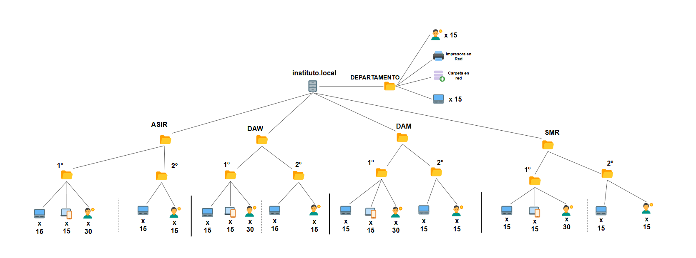


# Distribución de IPs
La red se organiza asignando un rango fijo a cada clase y departamento para identificarlos mejor.
Por cada rango se reservan 5 IPs por si fuera necesario escalar la red en otro momento.


### IPs reservadas (4)
```
192.168.33.0 -> RED
192.168.33.1 -> ROUTER
192.168.33.2 -> Controlador de Dominio
192.168.33.255 -> Broadcast
```

---

### DEPARTAMENTO (21)
```
192.168.33.3 -> Impresora en red (1)
192.168.33.4-18 -> Rango reservado para profesores (15)
192.168.33.19-23 -> Reservadas para escalar el departamento en el futuro (5)
```

---

### PRIMERO ASIR (35)
```
192.168.33.24-53 -> Rango reservado para alumnos ASIR 1 (30)
192.168.33.54-58 -> Reservadas para escalar la clase en el futuro (5)
```

### PRIMERO DAM (35)
```
192.168.33.59-88 -> Rango reservado para alumnos DAM 1 (30)
192.168.33.89-93 -> Reservadas para escalar la clase en el futuro (5)
```

### PRIMERO DAW (35)
```
192.168.33.94-123 -> Rango reservado para alumnos DAW 1 (30)
192.168.33.124-128 -> Reservadas para escalar la clase en el futuro (5)
```

### PRIMERO SMR (35)
```
192.168.33.129-158 -> Rango reservado para alumnos SMR 1 (30)
192.168.33.159-163 -> Reservadas para escalar la clase en el futuro (5)
```

---

### SEGUNDO ASIR (20)
```
192.168.33.164-178 -> Rango reservado para alumnos ASIR 2 (15)
192.168.33.179-183 -> Reservadas para escalar la clase en el futuro (5)
```

### SEGUNDO DAM (20)
```
192.168.33.184-198 -> Rango reservado para alumnos DAM 2 (15)
192.168.33.199-203 -> Reservadas para escalar la clase en el futuro (5)
```

### SEGUNDO DAW (20)
```
192.168.33.204-218 -> Rango reservado para alumnos DAW 2 (15)
192.168.33.219-223 -> Reservadas para escalar la clase en el futuro (5)
```

### SEGUNDO SMR (20)
```
192.168.33.224-238 -> Rango reservado para alumnos SMR 2 (15)
192.168.33.239-243 -> Reservadas para escalar la clase en el futuro (5)
```

### RANGO LIBRE (10)
```
192.168.33.244-254 -> Quedan sin asignar 11 IPs
```


# Automatizar creación de usuarios y equipos

## Automatizar creación de alumnos
El archivo de automatización se encuentra en **C:\Users\Administrador\Documents\alumnos.ps1** antes debes de modificar el archivo alumnos.csv codificado en **UTF-8** para evitar problemas con las tíldes.

Este archivo tiene la siguiente estructura:
```
Nombre,Primer Apellido,Segundo Apellido,Ciclo,Curso
María,Torres,Vázquez,ASIR,Primero
Carlos,Jiménez,Sánchez,ASIR,Primero
...
```


```powershell
# Módulo de Active Directory
Import-Module ActiveDirectory

# Archivo CSV
$usuariosCSV = "C:\Users\Administrador\Documents\alumnos.csv"

# Recorre archivo CSV y crea el usuario
Import-Csv -Path $usuariosCSV | ForEach-Object {
    $nombre         = $_.Nombre
    $primerApellido = $_."Primer Apellido"
    $segundoApellido= $_."Segundo Apellido"
    $ciclo          = $_.Ciclo
    $curso          = $_.Curso

    # Ruta de la OU
    $OU = "OU=$curso,OU=$ciclo,DC=instituto,DC=local"

    # Nombre del usuario
    $nombreCompleto = "$nombre $primerApellido $segundoApellido"

    # Nombre del dominio | David Grande García -> david.gragar
    $nombreUsuario = ($nombre + '.' + $primerApellido.Substring(0,3) + '' + $segundoApellido.Substring(0,3)).ToLower()

    # Quitar tíldes
    $nombreUsuario = $nombreUsuario -replace "á", "a"
    $nombreUsuario = $nombreUsuario -replace "í", "i"
    $nombreUsuario = $nombreUsuario -replace "é", "e"
    $nombreUsuario = $nombreUsuario -replace "ó", "o"
    $nombreUsuario = $nombreUsuario -replace "ú", "u"

    # User Principal Name (UPN)
    $UPN = "$nombreUsuario@instituto.local"

    # Contraseña temporal
    $password = ConvertTo-SecureString "PasswordTemporal123!" -AsPlainText -Force

    # Carpeta en red del usuario
    $homeCarpeta = "\\DC-INSTITUTO\alumnos\$nombreUsuario"

    # Crear el usuario en AD
    New-ADUser `
        -Name $nombreCompleto `
        -GivenName $nombre `
        -Surname "$primerApellido $segundoApellido" `
        -SamAccountName $nombreUsuario `
        -UserPrincipalName $UPN `
        -Path $OU `
        -AccountPassword $password `
        -Enabled $true `
        -ChangePasswordAtLogon $true `
        -HomeDirectory $homeCarpeta `
        -HomeDrive "Z:" `
        -Description ""
    
    # Crea la carpeta del usuario en red
    New-Item -ItemType Directory -Path $homeCarpeta -Force | Out-Null

    # Asigna permisos FULL CONTROL al usuario propietario
    $acl = Get-Acl $homeCarpeta
    $accessRule = New-Object System.Security.AccessControl.FileSystemAccessRule("instituto\$nombreUsuario", "FullControl", "ContainerInherit, ObjectInherit", "None", "Allow")
    $acl.AddAccessRule($accessRule)
    Set-Acl -Path $homeCarpeta -AclObject $acl

}

```
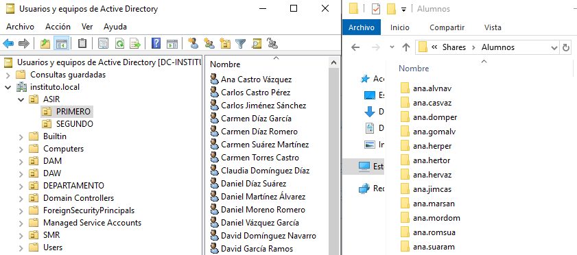


## Automatizar creación de profesores
Para crear los profesores también se le pasará un archivo CSV a un script diseñado para crear usuarios de profesores.

El archivo de automatización se encuentra en **C:\Users\Administrador\Documents\profesores.ps1** antes debes de modificar el archivo profesores.csv codificado en **UTF-8** para evitar problemas con las tíldes.

Este archivo tiene la siguiente estructura:

```
Nombre,Primer Apellido,Segundo Apellido
Víctor José,González,Rodríguez
Javier,Fraile,Garmón
...
```


```powershell
# Módulo de Active Directory
Import-Module ActiveDirectory

# Archivo CSV
$usuariosCSV = "C:\Users\Administrador\Documents\profesores.csv"

# Recorre archivo CSV y crea el usuario
Import-Csv -Path $usuariosCSV | ForEach-Object {
    $nombre         = $_.Nombre
    $primerApellido = $_."Primer Apellido"
    $segundoApellido= $_."Segundo Apellido"

    # Ruta de la OU
    $OU = "OU=DEPARTAMENTO,DC=instituto,DC=local"

    # Nombre del usuario
    $nombreCompleto = "$nombre $primerApellido $segundoApellido"

    # Quitar tíldes
    $nombreCompleto = $nombreCompleto -replace "á", "a"
    $nombreCompleto = $nombreCompleto -replace "í", "i"
    $nombreCompleto = $nombreCompleto -replace "é", "e"
    $nombreCompleto = $nombreCompleto -replace "ó", "o"
    $nombreCompleto = $nombreCompleto -replace "ú", "u"

    # Nombre del dominio | Víctor José González Rodríguez -> victorjose.gon.rod
    $nombreUsuario = ($nombre + '.' + $primerApellido.Substring(0,3) + '' + $segundoApellido.Substring(0,3)).ToLower()

    # Quitar tíldes y espacios
    $nombreUsuario = $nombreUsuario -replace " ", ""
    $nombreUsuario = $nombreUsuario -replace "á", "a"
    $nombreUsuario = $nombreUsuario -replace "í", "i"
    $nombreUsuario = $nombreUsuario -replace "é", "e"
    $nombreUsuario = $nombreUsuario -replace "ó", "o"
    $nombreUsuario = $nombreUsuario -replace "ú", "u"

    # User Principal Name (UPN)
    $UPN = "$nombreUsuario@instituto.local"

    # Contraseña temporal
    $password = ConvertTo-SecureString "PasswordProfesor123!" -AsPlainText -Force


    # Crear el usuario en AD
    New-ADUser `
        -Name $nombreCompleto `
        -GivenName $nombre `
        -Surname "$primerApellido $segundoApellido" `
        -SamAccountName $nombreUsuario `
        -UserPrincipalName $UPN `
        -Path $OU `
        -AccountPassword $password `
        -Enabled $true `
        -ChangePasswordAtLogon $true `
        -Description ""
}

```

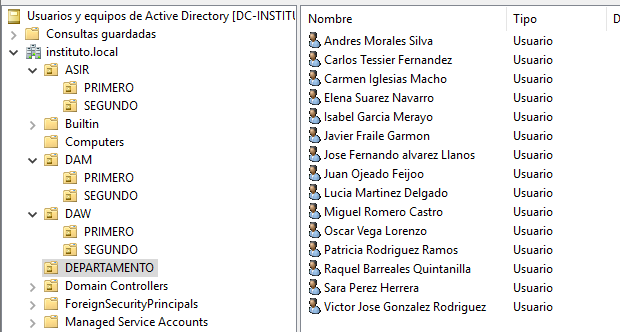


## Automatizar creación de equipos de alumnos
Para nombrar a los equipos se sigue el siguiente patrón:

**1º ASIR**: PC-1-ASIR-1, PC-2-ASIR-1 ...

**2º SMR**: PC-1-SMR-2, PC-2-SMR-2 ...

En el archivo CSV se encuentran todos los equipos con la información necesario para guardárlos en la Unidad Organizativa correspondiente.

```
Nombre,Ciclo,Curso
PC-1-ASIR-1,ASIR,PRIMERO
PC-2-ASIR-1,ASIR,PRIMERO
...
```

```powershell
# Módulo de Active Directory
Import-Module ActiveDirectory

# Archivo CSV
$usuariosCSV = "C:\Users\Administrador\Documents\equiposAlumnos.csv"

# Recorre archivo CSV y crea el equipo
Import-Csv -Path $usuariosCSV | ForEach-Object {
    $nombre = $_.Nombre
    $ciclo = $_."Ciclo"
    $curso= $_."Curso"

    # Ruta de la OU
    $OU = "OU=$curso,OU=$ciclo,DC=instituto,DC=local"

    New-ADComputer -Name $nombre -Path $OU -Enabled $true -Description ""
}

```


# Carpetas compartidas

## Carpetas personales

## Carpetas de grupos
El servidor tiene un **disco de 30GB** (C:) reservado para el propio sistema y otro **disco de 100GB** (D:) para almacenar las carpetas compartidas en red.

Los alumnos tienen acceso a la carpeta que les corresponda según su grado y curso, esta es la estructura:
```
GRADOS
│
├── ASIR-1
│
├── ASIR-2
│
├── DAM-1
│
├── DAM-2
│
├── DAW-1
│  
├── DAW-2
│
├── SMR-1
│
└── SMR-2

```
Primero se comparte la carpeta GRADOS en red.
Dentro de cada UO de cada curso se crea un **recurso compartido** y se configura la ruta que corresponde.

Hay que configurar los permisos de las carpetas, para ello hay que crear un grupo por curso, todos los usuarios de ASIR-1 están en un grupo llamado **ASIR1**. De esta forma se limita el acceso de otros usuarios que no están en ese grupo. Se asigna FULL CONTROL a los alumnos pertenecientes al grupo.

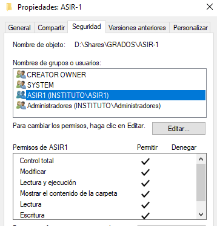


Después, se crea una GPO para cada UO de cada curso asignando la unidad de red.

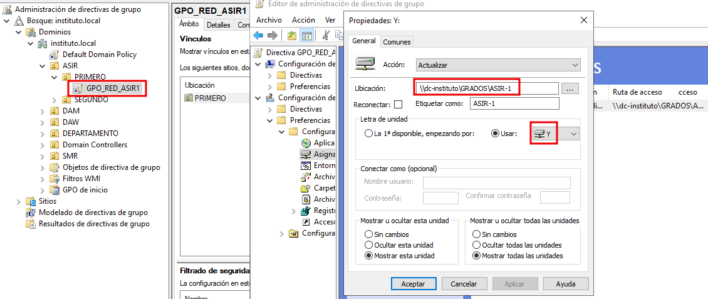

Al iniciar sesión con cualquier usuario, aparecerá su carpeta personal y el disco del grupo.


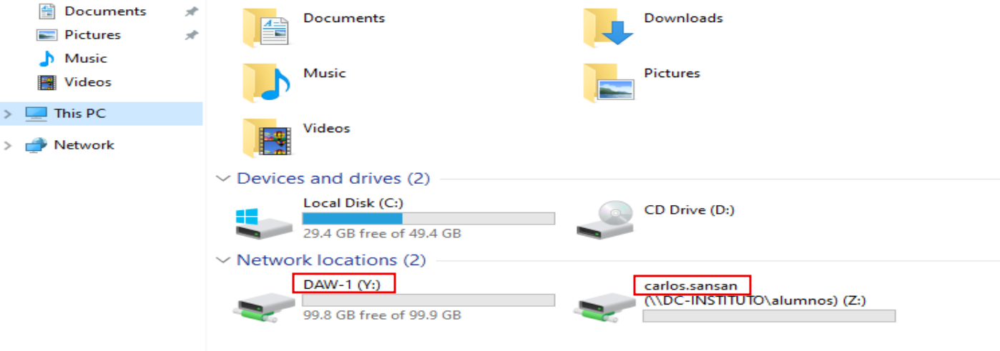
*Ejemplo con un alumno de DAW-1*


# Directivas

## Directivas de usuario

### Administrador de la red
Un profesor es el encargado de realizar tareas administrativas, para este curso ha sido nombrado el profesor Jose Fernando.

Está incluido en el grupo **Domain Admins**, el se encargará de crear nuevos usuarios, moverlos de curso, etc...

Para facilitar la administración de la red, Fernando delega la configuración de las GPO de cada grado en el profesor Juan Ojeado.

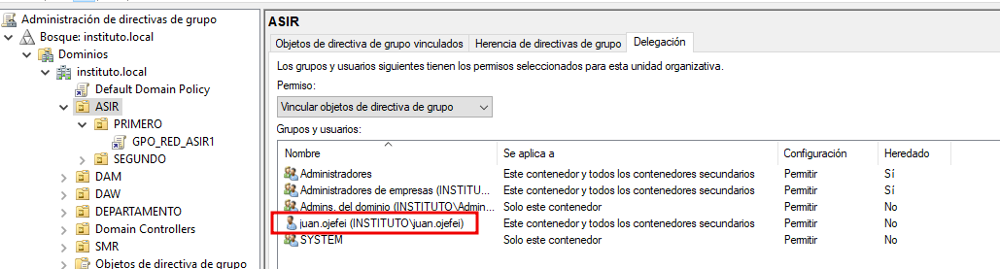

### Grados de programación (GPO_JAVA)

Los grados de programación como DAW y DAM necesitan instalar el lenguaje Java, los equipos que estén dentro de estas OU tienen un paquete .msi preparado para instalar.

Así los equipos estarán preparados para trabajar y todos con la misma versión para evitar conflictos.

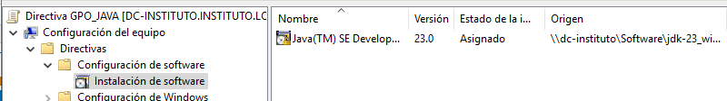


### Grados de redes (GPO_PACKET_TRACER)

Los grados como ASIR y SMR necesitan usar la herramienta de Packet Tracer, también estará configurada en cada grado para su instalación automática.

### Accesos directos (GPO_WEB_INST)

Los profesores tienen en su escritorio un acceso directo a la página del instituto, al ser una página muy utilizada les facilita el acceso más rápido.

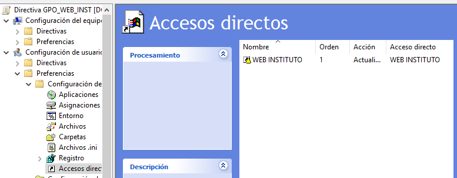


### Bloqueo de panel de control (GPO_ALUMNOS)

Los alumnos no pueden abrir el panel de control, así se evita que puedan modificar alguna configuración del ordenador y deje de funcionar correctamente.

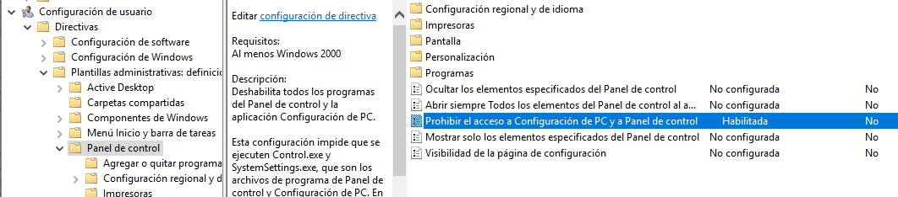


### Bloqueo fondo de pantalla (GPO_ALUMNOS)

A la gran mayoría de alumnos les gusta poner su fondo de pantalla, pero esto no es lo más adecuado para un centro educativo, todos tienen un mismo fondo de pantalla.

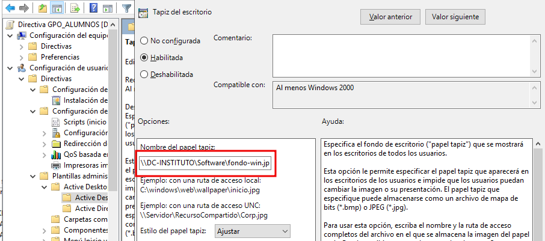

### Apagar equipo a las 15H (APAGAR_EQUIPO)

Todos los equipos de los alumnos se apagarán automaticamente a las 15:00 para evitar un gasto de luz innecesario si se lo han dejado encendido.

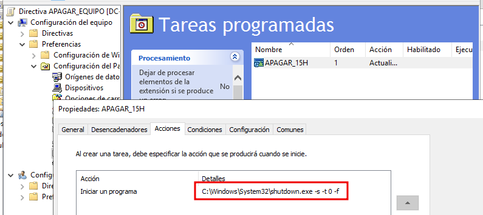


### RESULTADO FINAL

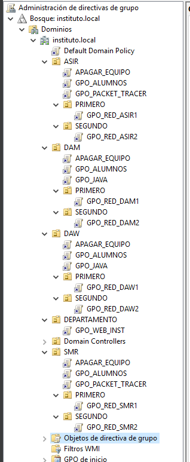
