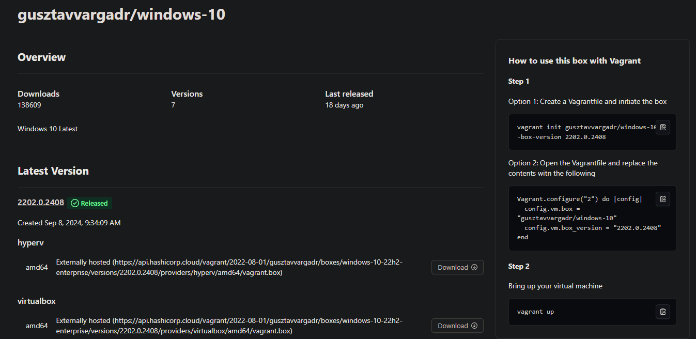
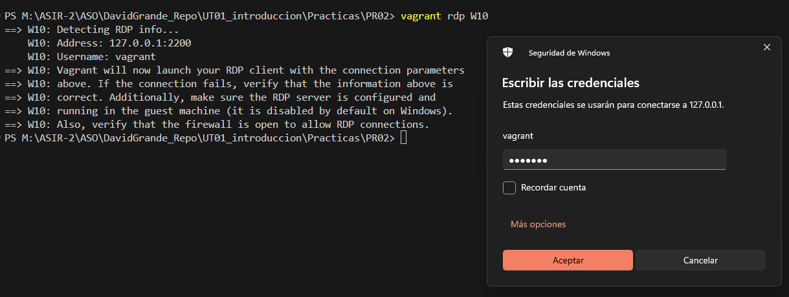
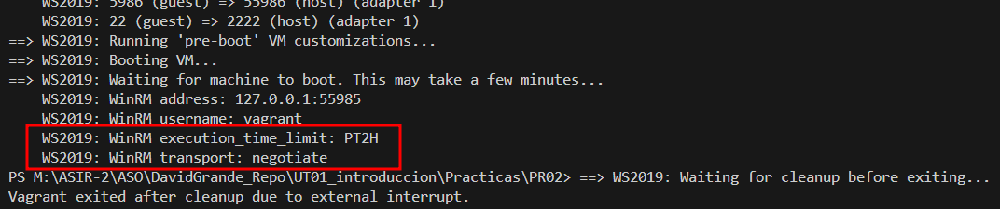

# WINDOWS 10 + WINDOWS SERVER 2019 | Documentación PR02

## Buscar la máquina

Descargamos la máquina **Windows Server 2019** desde hashicorp



Descargamos la máquina **Windows 10** desde hashicorp


## Importar máquinas

Con los siguientes comandos importamos las dos máquinas a nuestro equipo.

```
vagrant box add gusztavvargadr/windows-10
vagrant box add gusztavvargadr/windows-server-2019-standard

vagrant init gusztavvargadr/windows-10 --box-version 2202.0.2408
vagrant init gusztavvargadr/windows-server-2019-standard --box-version 1809.0.2407
```

## Configuraciones


```ruby
# -*- mode: ruby -*-
# vi: set ft=ruby :

Vagrant.configure("2") do |config|

  

  config.winrm.transport = "plaintext"
  config.winrm.basic_auth_only = true

  config.vm.define "WS2019" do |win19| 
      win19.vm.box = "gusztavvargadr/windows-server-2019-standard"
      win19.vm.hostname = "WS2019"
      win19.vm.network "private_network", ip: "10.10.11.33", netmask: "255.255.255.0"
      win19.vm.provider "virtualbox" do |vb|
          vb.memory = "4096"
          vb.cpus = 4
      end
  end


  config.vm.define "W10" do |w10|
      w10.vm.box = "gusztavvargadr/windows-10"
      w10.vm.hostname = "W10"
      w10.vm.network "private_network", ip: "10.10.11.32", netmask: "255.255.255.0"
      w10.vm.provider "virtualbox" do |vb|
          vb.memory = "2048"
          vb.cpus = 2
      end
  end

end
```

## Acceso por RDP

```
vagrant rdp W10
vagrant rdp WS2019
```



## Comprobar IP y Hostname

Con los comandos **ipconfig** y **hostname** vemos la IP y el nombre del equipo.

### WINDOWS 10


### WINDOWS SERVER 2019


## Comprobar conectividad

Realizamos un **ping** entre ambas máquinas y si tenemos conectividad.


## Solución de errores

### Error WinRM

La máquina no arranca debido un error de WinRM:



Buscando por internet encuentro una solucción:

Añadimos estas líneas al archivo Vagrantfile, 
```
config.winrm.transport = "plaintext"
config.winrm.basic_auth_only = true
```

### Problema conectividad

Cuando intentamos hacer un ping la primera vez no llegan los paquetes porque el firewall filtra los paquetes ICMP, vamos a deshabilitar el firewall temporalmente para la prueba aunque lo ideal sería crear una regla en el firewall que permita los paqutes ICMP.


