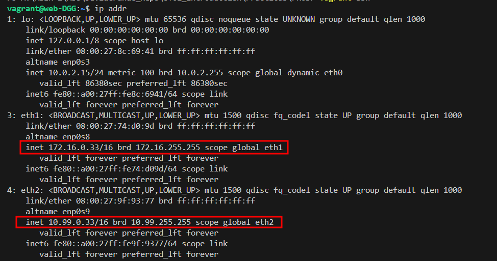

# Ubuntu Server 22.04 | Documentación PR03

## Buscar la máquina

Descargamos la máquina desde hashicorp


## Importar máquina

Con el siguiente comando importamos la máquina a nuestro equipo.

```
vagrant init generic/ubuntu2204
```

## Configuraciones


Código utilizado, explicación de cada comando en un comentario:

```ruby
# -*- mode: ruby -*-
# vi: set ft=ruby :

Vagrant.configure("2") do |config|
  config.vm.box = "generic/ubuntu2204"
  
  # Hostname del equipo 
  config.vm.hostname = "web-DGG"

  # Redirecciona el puerto 80 de la máquina Ubuntu a nuestro puerto Localhost:8080
  config.vm.network "forwarded_port", guest: 80, host: 8080

  # Redes que nos pide crear el ejercicio, asignamos máscara 255.255.0.0 ya que pide que sea /16
  config.vm.network "private_network", ip: "172.16.0.33", netmask:"255.255.0.0"
  config.vm.network "public_network", ip: "10.99.0.33", netmask:"255.255.0.0"

  # En la carpeta "website" de la máquina Windows se comparten los archivos HTML a la carpeta /var/www/html del servidor web.
  config.vm.synced_folder "./website", "/var/www/html"

  config.vm.provider "virtualbox" do |vb|

    # Configuración necesaria en mi caso para poder tener internet
    vb.customize ["modifyvm", :id, "--natdnshostresolver1", "on"]
    vb.customize ["modifyvm", :id, "--natdnsproxy1", "on"]

    # Nombre de la máquina
    vb.name = "Web Server"

    # RAM y CPU
    vb.memory = "3072"
    vb.cpus = 3
  end

end

```
## Solución de errores

La máquina no tiene conexión directa a internet y no se puede ejecutar los comando **update** ni **install** para instalar APACHE.

He tenido que añadir las siguientes líneas para que pueda actualizar los repositorios e instalar programas.

```
vb.customize ["modifyvm", :id, "--natdnshostresolver1", "on"]
vb.customize ["modifyvm", :id, "--natdnsproxy1", "on"]
```

## Inicio de la máquina

Iniciamos la máquina con el siguiente comando:
```
vagrant up
```

Accedemos a la máquina a través de SSH
```
vagrant ssh
```

## Instalación de APACHE

```
sudo apt-get update # Actualiza repositorios
sudo apt-get install apache2 # Instala Apache
```

## Comprobaciones

El nombre de la máquina, la memoria y la CPU están correctamente configuradas.


El HOSTNAME también aparece con la configuración correcta.


Los adaptadores de red están creados y nos asigna una IP para cada uno de ellos de forma automática.
Tenemos otro adaptador, el eth0 pero este lo crea por defecto.



Creación de archivos HTML en la carpeta Website.


Comprobamos si desde la máquina Windows hay acceso a la web y si que lo hay a través del Localhost puerto 8080.


