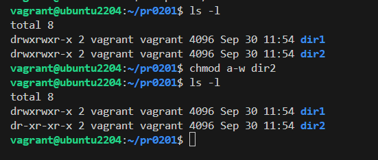
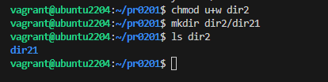

# Permisos Linux  | T2 - PR01

## Buscar la máquina

Descargamos la máquina **Ubuntu 22.04** desde hashicorp


## Importar máquinas

Con los siguientes comandos importamos las dos máquinas a nuestro equipo.

```
vagrant box add generic/ubuntu2204
vagrant init generic/ubuntu2204
```

## 1. Permisos de usuarios

Crea el directorio pr0201 dentro de tu directorio personal y dentro de él crea los directorios dir1 y dir2 ¿Cuáles son los permisos del directorio dir1? No pongas una captura, explica quiénes tienen permisos sobre el directorio y qué pueden hacer en él.

```
mkdir pr0201
mkdir pr0201/dir1
mkdir pr0201/dir2
```


Utilizando la notación simbólica, elimina todos los permisos de escritura (propietario, grupo, otros) del directorio dir2.



Utilizando la notación octal, elimina el permiso de lectura del directorio dir2, al resto de los usuarios.

```
chmod 551 dir2
```

¿Cuáles son ahora los permisos asociados a dir2?

```
vagrant@ubuntu2204:~/pr0201$ ls -l
total 8
drwxrwxr-x 2 vagrant vagrant 4096 Sep 30 11:54 dir1
dr-xr-x--x 2 vagrant vagrant 4096 Sep 30 11:54 dir2
```

Crear bajo dir2, un directorio llamado dir21.


Concédete a ti mismo permiso de escritura en el directorio dir2 e intenta de nuevo el paso anterior.

```
chmod u+w dir2
```




## 2. Notación octal y simbólica

### Notación Simbólica
```
rwxrwxr-x :
chmod ug=rwx,o=rx file 

rwxr--r-- :
chmod u=rwx,go=r file

r--r----- :
chmod ug=r,o= file

rwxr-xr-x :
chmod u=rwx,go=rx file

r-x--x--x :
chmod u=rx,go=x file

-w-r----x :
chmod u=w,g=r,o=x file

-----xrwx :
chmod u=,g=x,o=rwx file

r---w---x :
chmod u=r,g=w,o=x file

-w------- :
chmod u=w,go= file

rw-r----- :
chmod u=rw,g=r,o= file

rwx--x--x :
chmod u=rwx,go=x file

```

### Notación Octal
```
rwxrwxrwx :
chmod 777 file

--x--x--x :
chmod 111 file

r---w---x :
chmod 421 file

-w------- :
chmod 200 file

rw-r----- :
chmod 640 file

rwx--x--x :
chmod 711 file

rwxr-xr-x :
chmod 755 file

r-x--x--x :
chmod 511 file

-w-r----x :
chmod 241 file

-----xrwx :
chmod 017 file

```

## 3. Bit SETGID

Crea un grupo llamado asir y los usuarios {iniciales}1 e {iniciales}2, donde {iniciales} son las iniciales de tu nombre. Por ejemplo, en mi caso se llamarían vjgr1 y vjgr2.

```
addgroup asir
adduser --home /home/dgg1 --shell /bin/bash dgg1
adduser --home /home/dgg2 --shell /bin/bash dgg2

adduser dgg1 asir
adduser dgg2 asir
```

Crea el directorio /compartido y asigna propietario: root como usuario propietario y asir como grupo propietario.

```
mkdir /compartido
chown root:asir /compartido 
```

Asigna al directorio creado permisos de lectura, escritura y ejecución para el usuario y el grupo propietario. El resto de usuarios no tendrá ningún tipo de permiso.

```
chmod 770 /compartido
```

Establece el bit setgid en el directorio y verifica que se haya asignado.

```
chmod g+s /compartido
...
drwxrws---   2 root asir       4096 Oct  1 07:20 compartido
```

Inicia sesión con usuario1, accede al directorio y crea un fichero llamado fichero1 con algo de contenido. Comprueba los permisos del fichero que has creado.
```
su dgg1

dgg1@ubuntu2204:/compartido$ echo "Algo de contenido Xd" > fichero1
```

Permisos: 
```
-rw-rw-r-- 1 dgg1 asir 21 Oct  1 07:36 fichero1
```

Ahora inicia sesión con usuario2 y comprueba si puedes acceder a /compartido/fichero1 y si puedes añadirle contenido.

```
su dgg2

dgg2@ubuntu2204:/compartido$ cat fichero1 
Algo de contenido Xd
```

**¿Qué ventajas tiene usar el bit setgid en entornos colaborativos?**

El grupo de los archivos siempre será el mismo, en este caso el grupo **ASIR**. Esto permite que todos los usuarios que pertenezcan a ese grupo puedan leer y escribir cualquier archivo.


**¿Qué sucede si no se aplica el bit setgid en un entorno colaborativo?**

Habrá archivos con grupos distintos, entonces los usuarios aunque pertenezcan al mismo grupo (asir) no podrán ver el contenido de los archivos de otros usuarios del grupo.

---

Cuando hayas acabado, limpia el sistema eliminando los usuarios y el directorio creado para la práctica.

```
rm -r /compartido
userdel -r dgg1
userdel -r dgg2
groupdel asir
```

## 4. Sitcky Bit

Crea el directorio /compartido con todos los permisos para todos los usuarios.

```
root@ubuntu2204:/# mkdir /compartido
root@ubuntu2204:/# chmod 777 compartido
```

Crea dos usuarios {iniciales}1 e {iniciales}2
```
adduser --home /home/dgg1 --shell /bin/bash dgg1
adduser --home /home/dgg2 --shell /bin/bash dgg2
```

Vamos a probar primero el funcionamiento sin el sticky bit. Inicia sesión con el primer usuario, crea un fichero y luego, con el segundo usuario, intenta eliminarlo.

```
dgg1@ubuntu2204:/compartido$ touch prueba1

dgg2@ubuntu2204:/compartido$ rm prueba1 
rm: remove write-protected regular empty file 'prueba1'? yes
```
*Se borra el archivo prueba1*

Ahora establece el sticky bit en el directorio y verifica que se ve en los permisos

```
root@ubuntu2204:/# chmod o+t compartido
...
drwxrwxrwt   2 root root       4096 Oct  1 08:12 compartido
```

Vuelve a iniciar sesión con el primer usuario, crea un fichero e intenta eliminarlo con el segundo usuario.

```
dgg1@ubuntu2204:/compartido$ echo "hola" > prueba1.txt

dgg2@ubuntu2204:/compartido$ rm prueba1.txt
rm: remove write-protected regular file 'prueba1.txt'? yes
rm: cannot remove 'prueba1.txt': Operation not permitted
```

**¿Qué efecto tiene el sticky bit en un directorio?**

Evita que otros usuarios pueden eliminar archivos, solamente el propietario puede eliminar su archivo.

**Si tienes habilitado el sticky bit, ¿cómo tendrías que hacer para eliminar un fichero dentro del directorio?**

Tendría que acceder como el usuario propietario para poder eliminarlo.