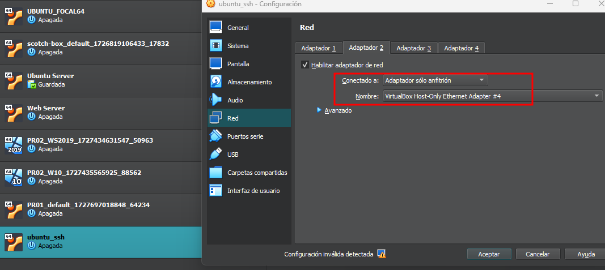
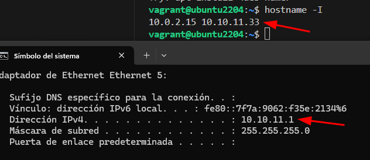
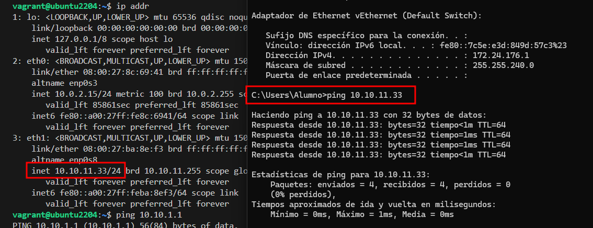
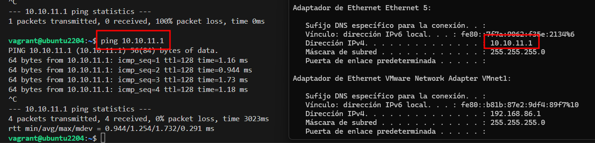
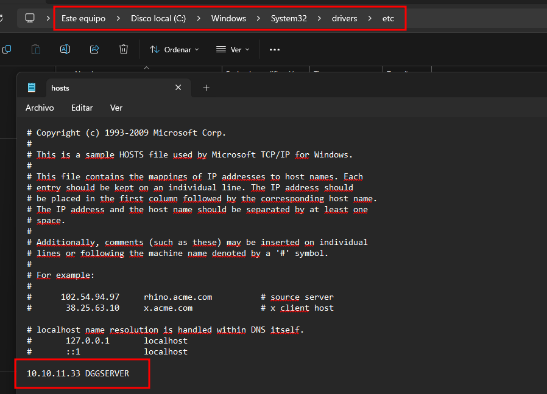
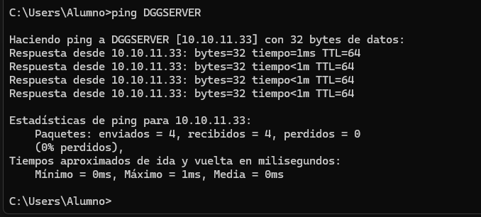

# Conexión SSH  | T2 - PR02

## Importar máquinas

Importamos la máquina UBUNTU

```
vagrant init generic/ubuntu2204
```

## 1. Configurar adaptador SOLO ANFITRIÓN

En el adaptador 2 añadimos la red solo anfitrión



## 2. IP del adaptador MÁQUINA y ANFITRIÓN

La IP de la máquina UBUNTU sería: **10.10.11.33**
Mientras que la máquina Windows **10.10.11.1**



## 3. Comprueba conectividad

Se realiza una prueba de conectividad desde Windows a Ubuntu



Ahora se prueba desde Ubuntu a Windows




## 4. Cambiar HOSTNAME

No se puede utilizar barra baja _ en el nombre de hostname.

```
sudo hostnamectl set-hostname DGGSERVER
```

## 5. Modificar archivo HOSTS Windows






# Creación de usuarios y conexión SSH

## 1. Crea un usuario en ubuntu

```bash
vagrant@DGGSERVER:~$ sudo useradd -m -s /bin/bash DGG_SSH
vagrant@DGGSERVER:~$ sudo passwd DGG_SSH
New password: 
Retype new password: 
passwd: password updated successfully
```
## 2. Conexión desde Windows a Ubuntu

```
C:\Users\Alumno>ssh DGG_SSH@10.10.11.33
The authenticity of host '10.10.11.33 (10.10.11.33)' can't be established.
ED25519 key fingerprint is SHA256:s5SXUX5967IV4hMwm6fun6heznCQTueYfgUEa7qxF4A.
This key is not known by any other names
Are you sure you want to continue connecting (yes/no/[fingerprint])? yes
Warning: Permanently added '10.10.11.33' (ED25519) to the list of known hosts.
DGG_SSH@10.10.11.33's password:

The programs included with the Ubuntu system are free software;
the exact distribution terms for each program are described in the
individual files in /usr/share/doc/*/copyright.

Ubuntu comes with ABSOLUTELY NO WARRANTY, to the extent permitted by
applicable law.

DGG_SSH@DGGSERVER:~$
```


## 3. Crear clave pública y privada SSH

Creamos el par de claves desde Windows.

```
C:\Users\Alumno>ssh-keygen -t rsa -b 4096 -C "david@david.com"
Generating public/private rsa key pair.
Enter file in which to save the key (C:\Users\Alumno/.ssh/id_rsa):
Enter passphrase (empty for no passphrase):
Enter same passphrase again:
Your identification has been saved in C:\Users\Alumno/.ssh/id_rsa
Your public key has been saved in C:\Users\Alumno/.ssh/id_rsa.pub
The key fingerprint is:
SHA256:KeWH0WeiizPeBUo9RTux5VP/tXlvH6wqg3ftiG7lBsQ david@david.com
The key's randomart image is:
+---[RSA 4096]----+
|          o . .  |
|         o * . . |
|        + B =   o|
|       + E = .  =|
|      o S .    oo|
|     . + * .  . o|
|      = o = .  oo|
|     . = *.+....o|
|      . =o=ooo  .|
+----[SHA256]-----+
```

Subimos la clave pública del usuario ALUMNO a la carpeta personal de DGG_SSH
```
C:\Users\Alumno>scp .ssh\id_rsa.pub DGG_SSH@10.10.11.33:/home/DGG_SSH/id_rsa.pub
DGG_SSH@10.10.11.33's password:
id_rsa.pub
```

Movemos la clave pública al directorio .ssh en ela archivo authorized_keys
```
mv id_rsa.pub .ssh/authorized_keys
```

Ahora accedemos a SSH sin necesidad de especificar contraseña.
```
C:\Users\Alumno>ssh DGG_SSH@10.10.11.33
Last login: Tue Oct  8 07:59:46 2024 from 10.10.11.1
DGG_SSH@DGGSERVER:~$
```