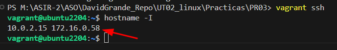
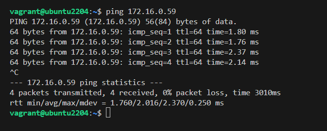
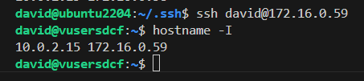
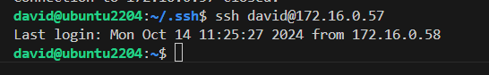
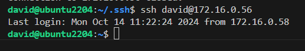

# Conexión SSH entre compañeros  | T2 - PR03

## Importar máquinas

Importamos la máquina UBUNTU

```
vagrant init generic/ubuntu2204
```

## 1. Configurar adaptador PUENTE

Para que sea posible conectarse entre compañeros configuramos la red **PUBLIC_NETWORK** desde Vagrantfile.

Mi IP será .58 haciendo referencia a mi número de equipo así no coinciden con las de mis compañeros.




# 2. Crear usuarios

Estos serán los usuarios de los compañeros que realizaremos la práctica.

```
sudo useradd -s /bin/bash -m david
vagrant@ubuntu2204:~$ sudo passwd david
New password: 
Retype new password: 
passwd: password updated successfully

david@ubuntu2204:/home/david$ ssh-keygen
```

```
vagrant@ubuntu2204:~$ sudo useradd -s /bin/bash -m -d /home/hugo hugo
vagrant@ubuntu2204:~$ sudo passwd hugo
New password: 
Retype new password:
passwd: password updated successfully

hugo@ubuntu2204:/home/hugo$ ssh-keygen
```

```
vagrant@ubuntu2204:~$ sudo useradd -s /bin/bash -m -d /home/diego diego
vagrant@ubuntu2204:~$ sudo passwd diego
New password: 
Retype new password:
passwd: password updated successfully

diego@ubuntu2204:/home/diego$ ssh-keygen
```

```
vagrant@ubuntu2204:~$ sudo useradd -s /bin/bash -m -d /home/alex alex
vagrant@ubuntu2204:~$ sudo passwd alex
New password: 
Retype new password:
passwd: password updated successfully

alex@ubuntu2204:/home/alex$ ssh-keygen
```


# 3. Conectarse al equipo de un compañero

Realizamos un PING al equipo .59 para comprobar que hay conectividad (lo mismo para todos los equipos)



Transfiero todas mis clave a cada usuario DAVID
```
scp id_rsa.pub david@172.16.0.56:/home/david/.ssh
scp id_rsa.pub david@172.16.0.57:/home/david/.ssh
scp id_rsa.pub david@172.16.0.59:/home/david/.ssh
```

Copiamos el archivo de clave pública al authorized_keys por cada usuario, cuando se conecten a mi servidor no le pedirá contraseña.
```
cp id_rsa.pub authorized_keys
```

## 3.1 SSH | authorized_keys

Ahora puedo conectarme a todos los equipos con mi usuario sin necesidad de usar contraseña.






