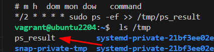

# Tareas programadas con CRON  | T2 - PR04


## 1. ¿Qué orden pondrías en crontab en los siguientes casos?

La tarea se ejecuta cada hora:
```
0 * * * *
```

La tarea se ejecuta los domingos cada 3 horas: 
```
0 */3 * * 0
```

La tarea se ejecuta a las 12 de la mañana los días pares del mes:
```
0 12 */2 * *
```

La tarea se ejecuta el primer día de cada mes a las 8 de la mañana y a las 8 de la tarde:
```
0 8,20 1 * *
```

La tarea se ejecuta cada media hora de lunes a viernes:
```
*/30 * * * 1-5
```

La tarea se ejecuta cada cuarto de hora, entre las 3 y las 8, de lunes a viernes, durante todo el mes de agosto.
```
*/15 3-8 * 8 1-5
```

La tarea se ejecuta cada 90 minutos:
```
*/90 * * * *
```

## 2. ¿Cómo compruebas si el servicio cron se está ejecutando?
Con este comando sabemos si está iniciado el servicio.
```
sudo systemctl status cron
```

## 3. ¿Cuál es el efecto de la siguiente línea crontab?
Cada 15 minutos, en las horas 1, 2 y 3 AM de cada día se ejecuta el comando WHO y su resultado se guarda en /tmp/test
```
*/15 1,2,3 * * * who > /tmp/test
```

## 4. Indica la ruta del fichero crontab del sistema
```
/etc/crontab
```

## 5. ¿Qué ficheros controlan los usuarios que pueden utilizar el crontab?
```
/etc/cron.allow
/etc/cron.deny
```

## 6. Excepcionalmente se debe iniciar una tarea llamada script.sh todos los lunes a las 07:30h antes de entrar en clase ¿Cómo lo harías?
```
30 7 * * 1 script.sh
```

## 7. Se ha cancelado la tarea. ¿Cómo listar y luego, suprimir la tarea?
```
ps aux 
kill <PID>
```

## 8. Ejecuta el comando ps -ef para el usuario root cada 2 minutos y redirecciona el resultado a /tmp/ps_result sin sobrescribir los antiguos.
```
*/2 * * * * sudo ps -ef >> /tmp/ps_result
```

## 9. Verifica la lista de tareas en crontab
```
crontab -l
```

## 10. Espera unos minutos y comprueba el resultado en /tmp


## 11. Crea el usuario asir2 y prohíbele utilizar el crontab.
Dentro del archivo no habrá nada, solamente escribimos el nombre del usuario que queremos bloquear las crontabs.
```
sudo useradd -s /bin/bash -m asir2
sudo vi /etc/cron.deny
```

## 12. Verifica que el usuario asir2 realmente no puede utilizar crontab
Este es el error que nos devuelve al intentar acceder a las crontabs con ASRI2.
```
asir2@ubuntu2204:~$ crontab -e
You (asir2) are not allowed to use this program (crontab)
See crontab(1) for more information
asir2@ubuntu2204:~$ 
```

## 13. Programa crontab para que cada día a las 0:05 se eliminen todos los ficheros que se encuentran en el directorio /tmp.
Elimina solo ficheros, no carpetas.
```
5 0 * * * sudo rm /tmp/*
```

## 14. Programa una tarea en el sistema que se lance de lunes a viernes a las 9 de la mañana durante los meses de verano (julio, agosto y septiembre) que escriba en un fichero la hora actual (comando date, aunque tienes que mirar la ayuda para elegir un formato comprensible) seguido del listado de usuarios que hay conectados en ese momento en el sistema (comando who)
```
0 9 * 7,8,9 1-5 date +%H:%M && who > /tmp/date_users.txt
```

## 15. El servicio cron se ayuda de una serie de ficheros y directorios que se encuentran en el directorio /etc. Explica la función de cada uno de los siguientes ficheros/directorios:
```
cron.d: Directorio para crontabs adicionales del sistema.
cron.allow: Lista de usuarios permitidos para usar crontab.
cron.deny: Lista de usuarios prohibidos para usar crontab.
cron.daily: Directorio para scripts que se ejecutan diariamente.
cron.hourly: Directorio para scripts que se ejecutan cada hora.
cron.monthly: Directorio para scripts que se ejecutan mensualmente.
```