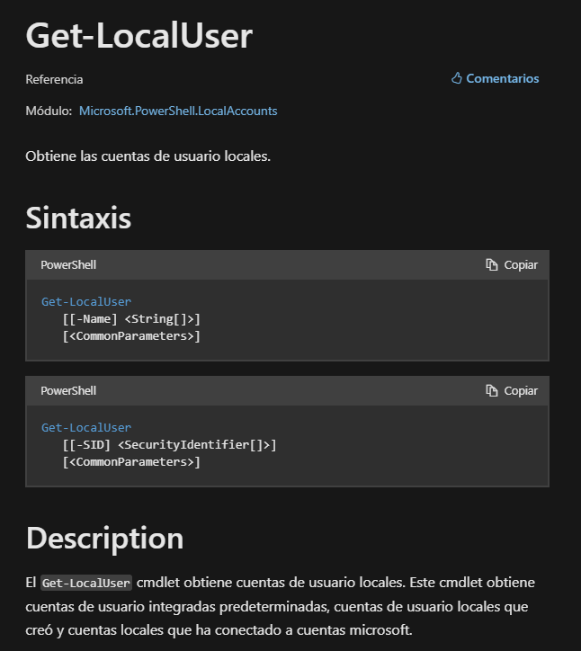
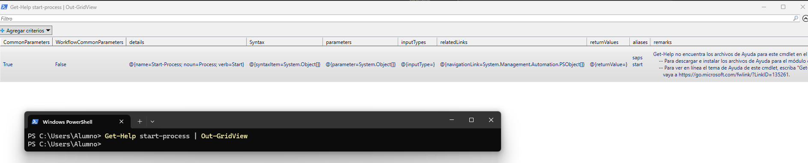
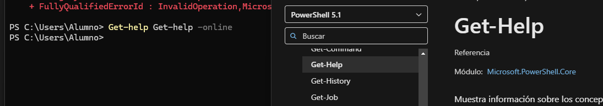

# PR0401: Introducción a Powerhsell

## 1. Obtén ejemplos de utilización del comando Get-LocalUser.

Muestra los usuarios locales del sistema, si está habilitado el usuario y su descripción.

## 2. Obtén un listado de todos los comandos relacionados con la gestión de usuarios locales (es decir, con el nombre LocalUser).

```powershell
Disable-LocalUser: Deshabilita usuarios.
Enable-LocalUser: Habilita usuarios.
New-LocalUser: Crea un nuevo usuario.
Remove-LocalUser: Elimina un usuario.
Rename-LocalUser: Cambia el nombre a un usuario.
Set-LocalUser: Modifica la cuenta de un usuario.
```
Estos comandos afectan a usuarios locales y NO a usuarios del dominio.

## 3. Utilizando la línea de comandos, muestra en el navegador la ayuda del comando Get-LocalUser.

```powershell
Get-Help Get-LocalUser -Online
```



## 4. Averigua para qué sirve el comando Set-Content y explícalo brevemente con tus palabras.

Con este comando es posible crear nuevos archivos de texto o modificar uno existente.
Unicamente hay que indicar el archivo y el contenido que queremos introducir.
```powershell
Set-Content -Path prueba\Test.txt -Value 'Texto introducido'
```

## 5. Explica tres formas diferentes de ver o buscar un comando que hayas utilizado anteriormente en tu sesión.

Formas de buscar comandos ejecutados anteriormente:
- Comando *history*
- Comando *invoke-history*
- Comando *get-History*


## 6. Averigua si el comando Get-Process tienen un parámetro llamado ComputerName y en caso afirmativo explica para qué sirve.

Si existe este argumento, sirve para obtener los procesos de un equipo concreto, en este caso no podemos acceder a otros equipos 
pero utilizando nuestro propio hostname funciona correctamente.
```powershell
Get-Process -ComputerName WIN-Q87CDVQ7KPS
```

## 7. Muestra la ayuda del comando Start-Process en una ventana emergente.

```powershell
Get-Help start-process | Out-GridView
```


## 8. Muestra la ayuda del comando Get-Help en el navegador invocándolo desde la línea de comandos.

```powershell
Get-help Get-help -online
```


 

## 9. Muestra las últimas 20 entradas del historial.

```powershell
Get-History | Select-Object -Last 20
```

## 10. Elimina las entradas 10, 12 y 14 de tu historial.

```powershell
Clear-History -Id 10
Clear-History -Id 12
Clear-History -Id 14
```