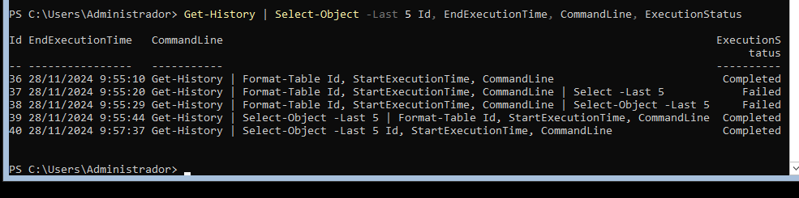
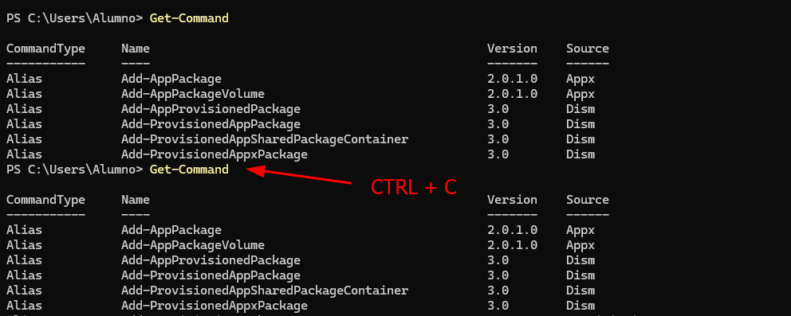
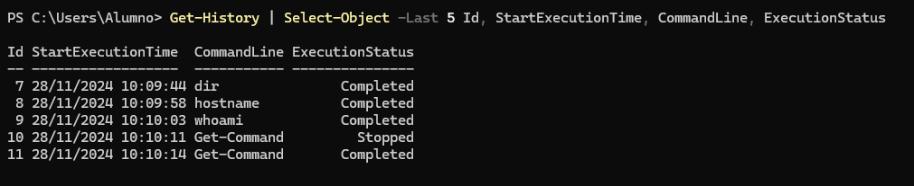
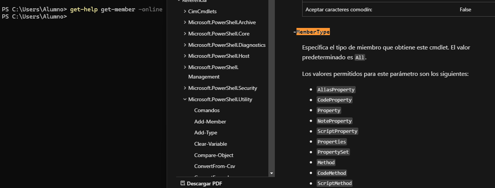

# PR0402: Introducción a Powershell (II)


## 1. Visualiza las últimas cinco entradas del historial, mostrando para cada una el comando, la hora en que finalizó su ejecución y el estado de ejecución.

```powershell
Get-History | Select-Object -Last 5 Id, StartExecutionTime, CommandLine, ExecutionStatus
```



## 2. Ejecuta el comando Get-Command (que muestra todos los comandos disponibles en Powershell) e interrúmpelo antes de que finalice su ejecución pulsando las teclas Ctrl-C. A continuación, ejecútalo dejando que finalice correctamente.

Ejecutamos el comando y lo detenemos con la combinación de teclas CTRL + C



## 3. Vuelve a ejecutar el comando del punto 1 y comprueba las diferentes salidas de finalización de estado de ejecución.

Vemos que el comando *Get-Command* ha sido detenido y en la segunda ejecución se completó su ejecución.


## 4. Muestra todos los procesos con el nombre msedge mostrando para cada uno el identificador, el consumo de CPU y los hilos (threads)

```powershell
Get-Process -Name msedge | Select-object Id, CPU, Threads
```

## 5. Averigua para qué sirve el parámetro -Delimiter del comando Export-CSV

Es utilizado para indicar con que símbolo queremos delimitar cada dato, se suele utilizar: coma(,) o punto y coma(;)

## 6. Muestra en una ventana la ayuda del comando Get-History

```powershell
Get-Help Get-History | out-GridView
```

## 7. Muestra un listado con todos los comandos que tengan el verbo Update.

```powershell
Get-Command -Name *update*
```

## 8. Ejecuta la herramienta Recortes y localízala usando el comando Get-Process teniendo en cuenta que el proceso se llama SnippingTool.exe

```powershell
Start-Process SnippingTool.exe
```

## 9. Averigua qué propiedades tienen los procesos devueltos con el comando Get-Process.

```powershell
PS C:\Users\Alumno> Get-Process

Handles  NPM(K)    PM(K)      WS(K)     CPU(s)     Id  SI ProcessName
-------  ------    -----      -----     ------     --  -- -----------
    141       9     2196       9304              9116   0 AggregatorHost
```
**Handles**: Número de archivos, sockets o registros en uso por este proceso.
**NPM**: Memoria RAM en uso (En KiloBytes).
**PM**: Memoria que puede ser transferida al disco como archivo de paginación (En KiloBytes).
**WS**: Memoria RAM utilizada por el proceso incluyendo las páginas de memoria activas.
**CPU**: Tiempo medio en segundos utilziado por el proceso.
**Id**: Identificador del proceso o PID.
**SI**: Identificador de la sesión, los usuarios utilizan el ID: 1 y procesos del sistema en ID: 0
**ProcessName**: Nombre del proceso.

## 10. Busca en la ayuda para qué sirve el parámetro -MemberType del comando Get-Member.



## 11. Desde la línea de comandos, finaliza la ejecución de la herramienta Recortes.

```powershell
stop-Process -ProcessName SnippingTool
```

## 12. Muestra todos los procesos que tienen el nombre svchost.

```powershell
get-Process -ProcessName svchost
```

## 13. Muestra por pantalla el número de instancias del proceso svchost.

```powershell
(get-Process -ProcessName svchost).count
```

## 14. Muestra por pantalla todos los procesos con el nombre svchost mostrando para cada uno: nombre, identificador, hora de inicio, tiempo total de procesador y clase de prioridad. Se deben mostrar de forma tabular.

```powershell
Get-Process -Name svchost | Select-Object ProcessName, Id, StartTime, CPU, PriorityClass | Format-Table
```

## 15. Repite la búsqueda anterior, pero ordenando por el campo tiempo total de procesador en sentido descendente.

```powershell
Get-Process -Name svchost | Select-Object ProcessName, Id, StartTime, CPU, PriorityClass | Sort-Object -Property CPU -Descending | Format-Table
```

## 16. Muestra los usuarios que hay en el sistema agrupándolos por la propiedad Enabled.

```powershell
Get-localuser | Group-object -property Enabled
```

## 17. Muestra los usuarios que hay en el sistema con la cuenta habilitada (propiedad Enabled puesta a True). Utiliza el filtrado con el comando Where-Object

```powershell
Get-localuser | Where-Object Enabled
```

## 18. Muestra un listado de todos los usuarios del sistema con el nombre y la fecha de la última vez que iniciaron sesión (tienes que buscar la propiedad que indique último inicio de sesión o last logon)

Hace falta instalar el módulo de AD para poder obtener la fecha de la última vez que iniciaron sesión.
Quizás sea posible realizarlo sin el comando *Get-ADUser* pero sería demasiado complejo.
 