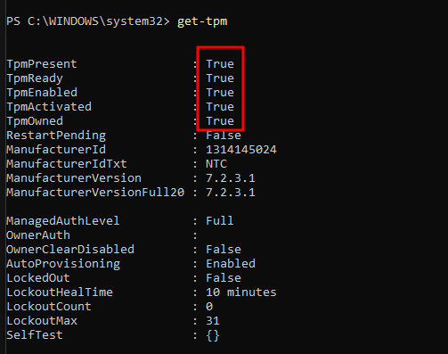

# PR0402: El pipeline en Powershell

## 1. El comando Get-Date muestra la fecha y hora actual. Muestra por pantalla únicamente el año en que estamos.

```powershell
get-date -Format 'yyyy'
```

## 2. Uno de los requisitos de Windows 11 es que es procesador tenga TPM habilitado. Powershell dispone del comando Get-TPM que nos muestra información sobre este módulo. Muestra por pantalla, en formato tabla, las propiedades TpmPresent, TpmReady, TpmEnabled y TpmActivated.



## 3. En los siguientes ejercicios trabajaremos con los ficheros devueltos por el comando Get-ChildItem C:\Windows\System32.


## 4. Muestra por pantalla el número de ficheros y directorios que hay en ese directorio.

Muestra el número de archivos y carpetas en el directorio C:\Windows\System32
```powershell
(Get-ChildItem C:\Windows\System32).count
```

## 5. Los objetos devueltos por el comando anterior tienen una propiedad denominada Extension, que indica la extensión del archivo. Calcula el número de ficheros en el directorio que tienen la extensión .dll.

```powershell
(Get-ChildItem C:\Windows\System32\*.dll).count
```

## 6. Muestra los ficheros del directorio con extensión .exe que tengan un tamaño superior a 50000 bytes.

```powershell
Get-ChildItem C:\Windows\System32\*.exe | where Length -gt 50KB
```

## 7. Muestra los ficheros de este directorio que tengan extensión .dll, ordenados por fecha de creación y mostrando únicamente las propiedades de fecha de creación (CreationTime), último acceso (LastAccessTime) y nombre (Name).

```powershell
Get-ChildItem -Path C:\Windows\System32\ -Filter *.dll | select-object creationtime, LastAccessTime, Name | sort-object CreationTime
```

## 8. Muestra el tamaño (Length) y nombre completo (FullName) de todos los ficheros del directorio ordenados por tamaño en sentido descendente.

```powershell
get-childitem c:\windows\system32 | select-object Fullname, Length | sort-object Length -descending
```

## 9. Muestra el tamaño y nombre completo de todos los ficheros del directorio que tengan un tamaño superior a 10MB (10000000 bytes) ordenados por tamaño.

```powershell
get-childitem c:\windows\system32 | where Length -gt 10000KB
```

## 10. Muestra el tamaño y nombre completo de todos los ficheros del directorio que tengan un tamaño superior a 10MB y extensión .exe ordenados por tamaño.

```powershell
get-childitem c:\windows\system32 -Filter *.exe | where Length -gt 10000KB | sort-object Length
```