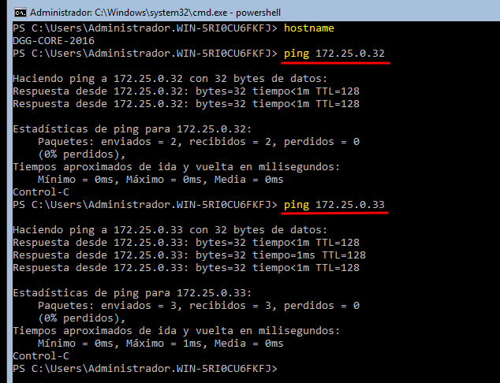

# PR0404: Administración remota del servidor

## 1. Entorno virtualizado

Instalación de WS2016 sin interfaz gráfica.


Tenemos las tres máquina preparadas con los dos adaptadores. NAT y Host-Only.


## 2. Preparación máquinas

### 2.1 Añade equipo a la red

```powershell
Set-NetIpAddress -InterfaceIndex 3 -IPAddress 172.25.0.34 -PrefixLength 16
```

Desde la nueva máquina WS2016 hacemos PING a los otros dos equipos de la red y funciona correctamente.


### 2.2 Nombre del equipo
```powershell
rename-computer -NewName "DGG-2019"
```

```powershell
rename-computer -NewName "DGG-CORE-2019"
```

```powershell
rename-computer -NewName "DGG-CORE-2016"
```

## 3. Acceso remoto

### 3.1 Habilita la conexión remota
```powershell
Enable-PSRemoting -Force
```

### 3.2 Incluir IPs en archivo TrustedHosts
Incluimos la IP 172.25.0.34 en el archivo TrustedHosts.


Para ver que el comando anterior funcionó mostramos la configuración con el comando:
```powershell
winrm get winrm/config/client
```

### 3.3 Crear usuarios
Crea usuario **DGG** en ambas máquina.


Añadir usuario al grupo de **Administradores**.


## 4. Configuración del acceso remoto sobre HTTPS

### 4.1 Crea certificado SSL
En el servidor **WS2019** creamos certificado SSL

```powershell
New-SelfSignedCertificate -DnsName "172.25.0.32" -CertStorageLocation Cert:\LocalMachine\My -KeyLength 2048
```

### 4.2 Crea listener a través del puerto 5986
Configuramos puerto 5986 que es el puerto de winRM seguro, añadimos a este puerto el certificado creado antes.

```powershell
New-Item -Path WSman:\lcoalhost\Listener -Transport HTTPS -Address * -CertificateThumbPrint <hashCertificado>
```

### 4.3 Exportar certificado
Para poder conectarnos al servidor mediante SSL, hay que exportar el certificado generado y tranferirlo al cliente.

```powershell
Export-Certificate -Cert Cert:\LocalMachine\My\<hashCertificado> -FilePath c:\certificado.cer
```

### 4.4 Carpeta compartida
Para compartir el certificado con el cliente creamos una carpeta compartida con SMB.


```powershell
New-SmbShare -Name "Compartida" -Path c:\Compartida -FullAccess dgg-core-2019\administrador
```

### 4.5 Transferir certificado al cliente.
Copiamos el archivo del certificado, que se encuentra en la carpeta compartida.


```powershell
copy //172.25.0.32/Compartida/certificado.cer
```

### 4.6 Importar certificado
Para que sea posible conectarse al servidor, importaremos el certificado al cliente.


```powershell
Import-Certificate -FilePath C:\Users\administrador\certificado.cer -CertStoreLocation Cert:\LocalMachine\Root
```

### 4.7 Acceso winRM a través de SSL
Ejecución de comandos en el servidor .32 con Invoke-Command


```powershell
Invoke-Command -ComputerName 172.25.0.32 -Credential (Get-Credential) -ScriptBlock {whoami} -UseSSL
```

Ejecutamos comandos en la máquina .34, antes habremos realizado los pasos anteriores en el servidor, exportaremos e importamos el certificado en el cliente.


```powershell
Invoke-Command -ComputerName 172.25.0.34 -Credential (Get-Credential) -ScriptBlock {whoami} -UseSSL
```