# PR0501: Carpetas personales y compartidas por un grupo

## 1. Creación de usuarios y grupos

Crear usuario **APEREZ**

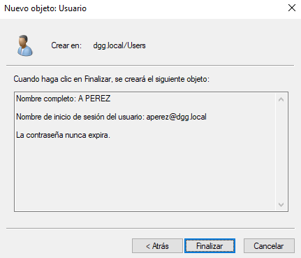

Crear usuario **FGONZALEZ**

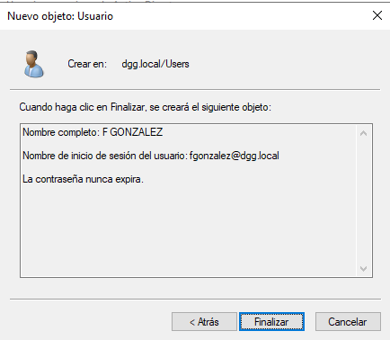

Crear grupo **ALUMNOS**

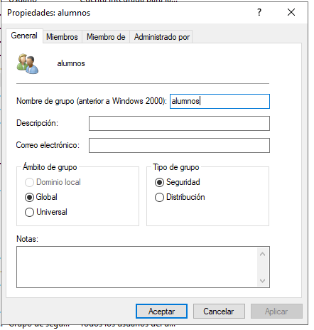

Añadir usuarios al grupo **ALUMNOS**

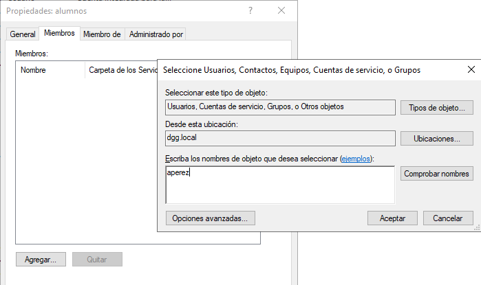

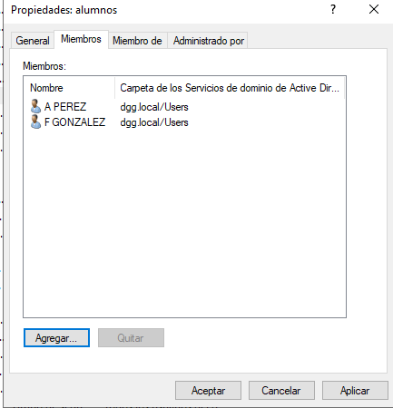

## 2. Carpetas personales

Instalación del **Administrador de recursos del servidor de archivos**

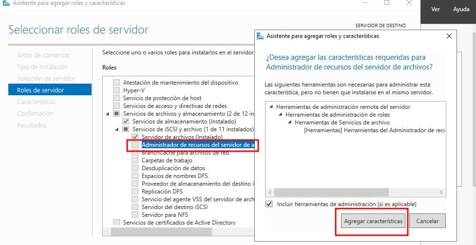

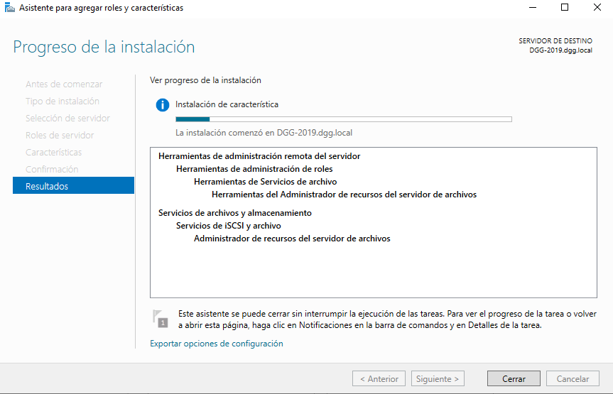

Creación de la carpeta personal

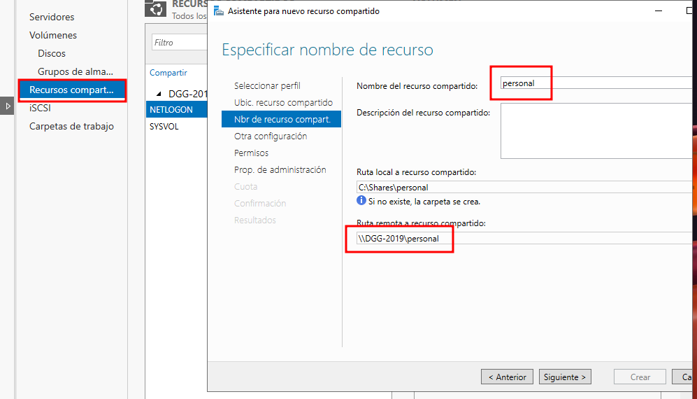

Cambiamos los permisos de la carpeta PERSONAL, para que solo puedan acceder los **Usuarios del dominio**

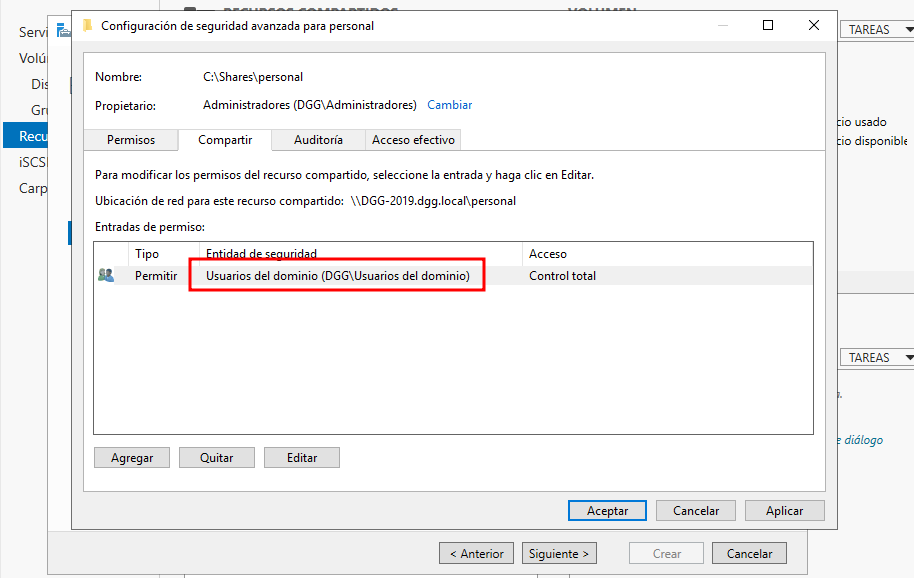

En la parte de permisos NTFS quitamos al grupo USUARIOS y la herencia, para evitar que un usuario acceda a la carpeta de otro usuario.
Y le añadimos **DOMAIN USERS** con permiso de LECTURA, pero solo a la carpeta **PERSONAL**

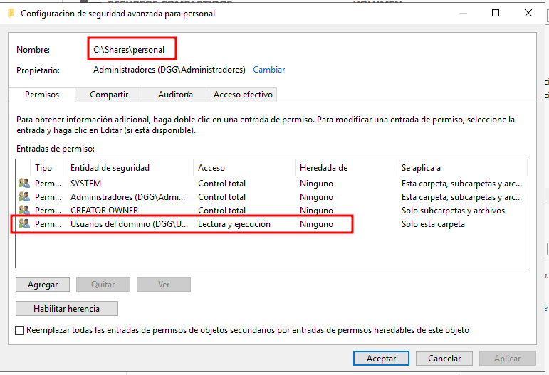

Este es el resumen final de la carpeta de usuarios que vamos a compartir con la red.

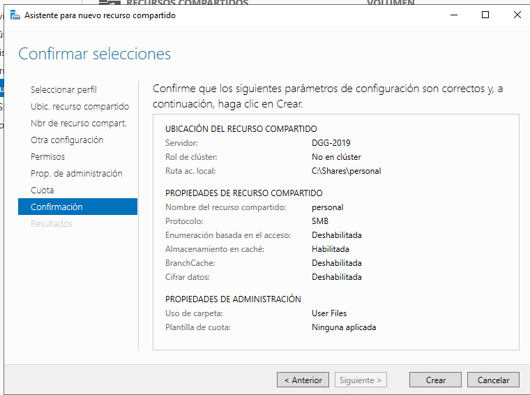

Se crean automáticamente las carpetas de los usuarios en el directorio de red **\\\\DGG-2019\personal\\%username%**

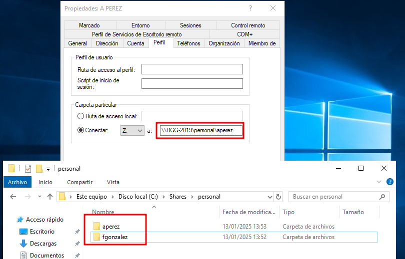

### Comprobar funcionamiento en el cliente

Primero añadimos la máquina W10 al dominio

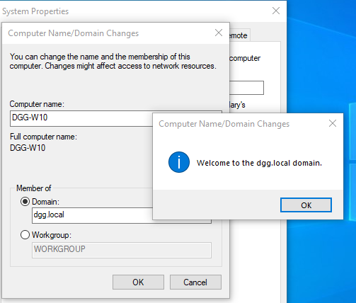

Ahora accedemos al W10 con el usuario **APEREZ**

La unidad compartida aparece correctamente.

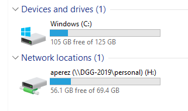

Con el usuario **FGONZALEZ** creamos un archivo desde la máquina W10 y desde WS2019 comprobamos que se ha creado correctamente.

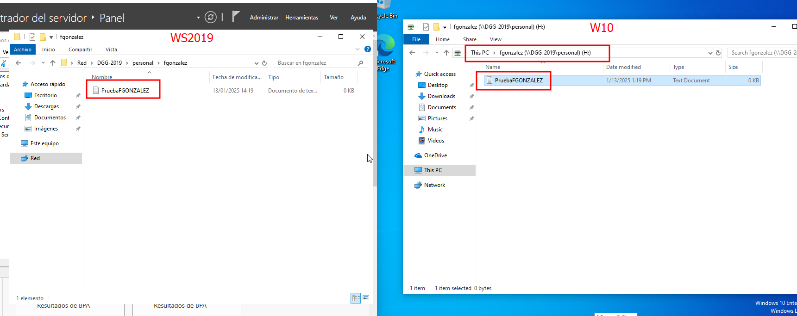

El usuario **FGONZALEZ** no puede entrar a la carpeta de APEREZ.

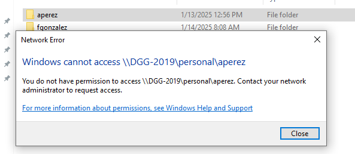

## Carpetas compartidas por un grupo

Crear carpeta APUNTES

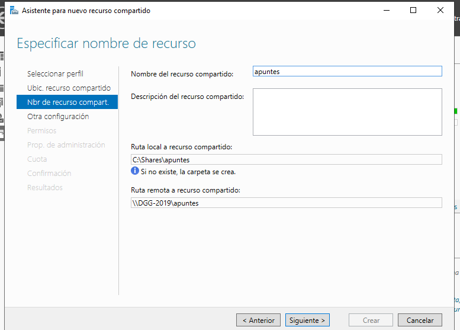

Configuración de permisos en RED y NTFS

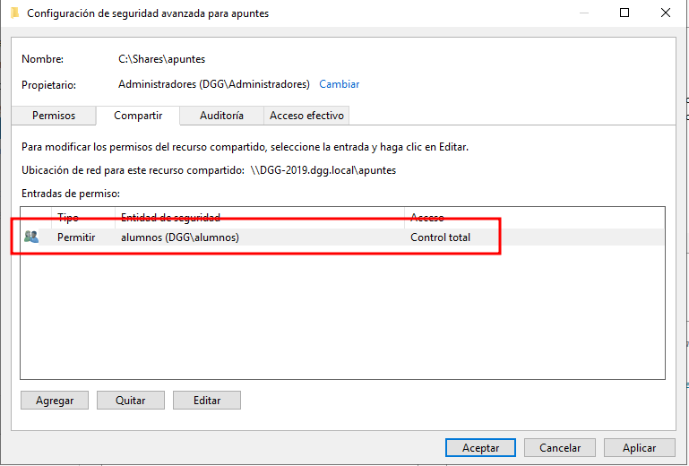

El grupo **ALUMNOS** tiene CONTROL TOTAL.

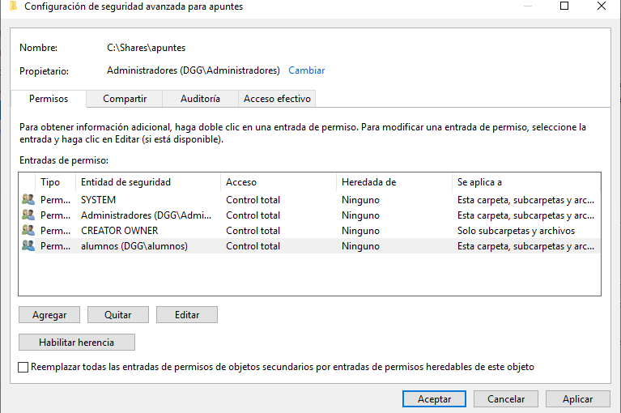

La carpeta funciona correctamente, estos son sus permisos.

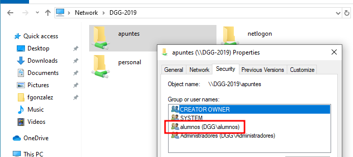

