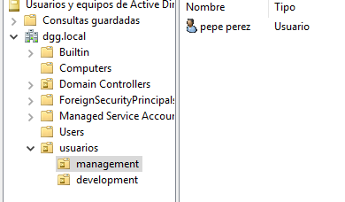
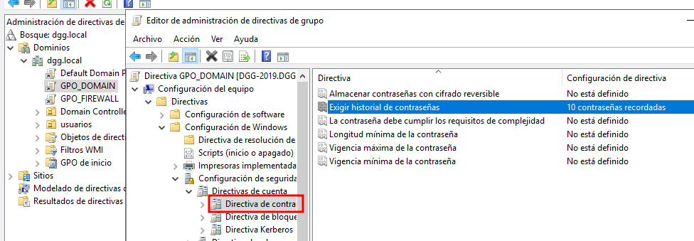

# PR0502: Aplicación de directivas

## 1. Creación de usuarios y grupos

Creación de Unidades Organizativas


Creación de un usuario para cada UO
Usuario **pepe.perez**



Usuario **juan.gonzalez**


## Directiva 1

Esta directiva aplica a los **Usuarios Autenticados** que estén incluidos en la UO MANAGEMENT.
No podrán cambiar el fondo de pantalla


## Directiva 2

Esta directiva aplica a los **Usuarios Autenticados** que estén incluidos en la UO DEVELOPMENT.
Podrán ejecutar Scripts sin restricciones.


## Directiva 3

Esta directiva aplica a los equipos del dominio, excepto al equipo DEV-PC1
El Firewall se habilita para todos los equipos del dominio.


Creación del Filtro VMI para excluir el equipo **DEV-PC1**


Ahora aplicamos el filtro VMI a la GPO **GPO_FIREWALL**
Y subimos su prioridad en el dominio.


## Directiva 4

Esta directiva aplica a los equipos del dominio, se actualizarán automaticamente todos los días a las 21:00

Esta GPO se crea directamente en el dominio y se le da un orden de prioridad por encima de "Default Domain Policy"


## Directiva 5

En ningún PC del Dominio será posible leer o escribir en un USB, esto evitará problemas de seguridad.


## Directiva 6

Ningún usuario podrá reutilizar las 10 contraseñas anteriores.



Excepto los usuarios de las UO **development** y **management**, estos pertenecen a otra UO llamada **usuarios**
Creamos la GPO en usuarios y la transmitirá a las otras UO.


## Directiva 7

Todos los portátiles entrarán en modo hibernación a los 30 minutos (1800 segundos)


Utilizaremos el siguiente filtro VMI para que solo afecte a los portátiles.

```sql
SELECT * FROM Win32_Battery WHERE Availability != 0
```


